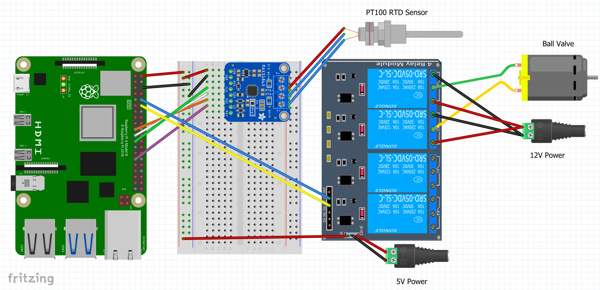

# Distillation_Pi
An automated distillation software intended to reduce the run to run variability in distillation.

## Electronics Equipment
1. Raspberry Pi 4B+
2. RTD PT100 Temperature Sensor (Adafruit)
3. MAX31865 RTD Signal Amplifier (Adafruit)
4. 5V 8 Channel relay (Songle - Amazon)
5. 9-24V 5-wire Motorized Ball Valve (US Solid - Amazon)
6. Breadboard and Jumper Wires Kit (Amazon)
7. Soldering Kit (Amazon)

## Distillation Equipment
1. 15gal Keg (Craigslist)
2. 50gal Metal Trash Can (Hardware Store)
3. XX BTU Natural Gas Burner (Amazon)
4. Column (1.5 ft, Stainless Steel, Hardware Store)
5. Reflux Dephlegmator (1.5 ft, Stainless Steel, Ali Express)
6. Sight Glass (6 in, Ali Express)
7. Elbow (Stainless Steel, Ali Express)
8. Condenser Dephlegmator (1.5 ft, Ali Express)
9. Parrot (Stainless Steel, Ali Express)
10. Submersible Pump (550gal/hr, Amazon)
11. Aluminum Radiator (OfferUp)
12. Box Fan (Amazon)
13. Tubing (XXX, Hardware Store)
14. Tri-Clamps (XXX, Hardware Store)
15. Alcometer (Amazon)
17. Mason Jars (12 pack of ~900 mL, Walmart)

## Fritzing Circuit Diagram

## Future Updates:
1. User input for target temperature and control limits
2. Integrate a few Hall Effect flow sensors into the design and use flow rate data to module ball valve
3. Incorporate the fully open or fully closed sensors to output to user that system is maxed out
4. PID Controller instead of Bang Bang if statements
5. Recommended PID controls or set points based on target product (Vodka, Tequila, Brandy, Gin, etc.)
6. Heating regulation
7. Front end dashboard for remote monitoring
8. Create dedicated printed circuit boards (PCBs)
9. Create kits of various sizes for sale
10. Integrate a Compute Module 4 instead of a 4B+
11. Use an integrated circuit to reduce the number of pins required to run the system
