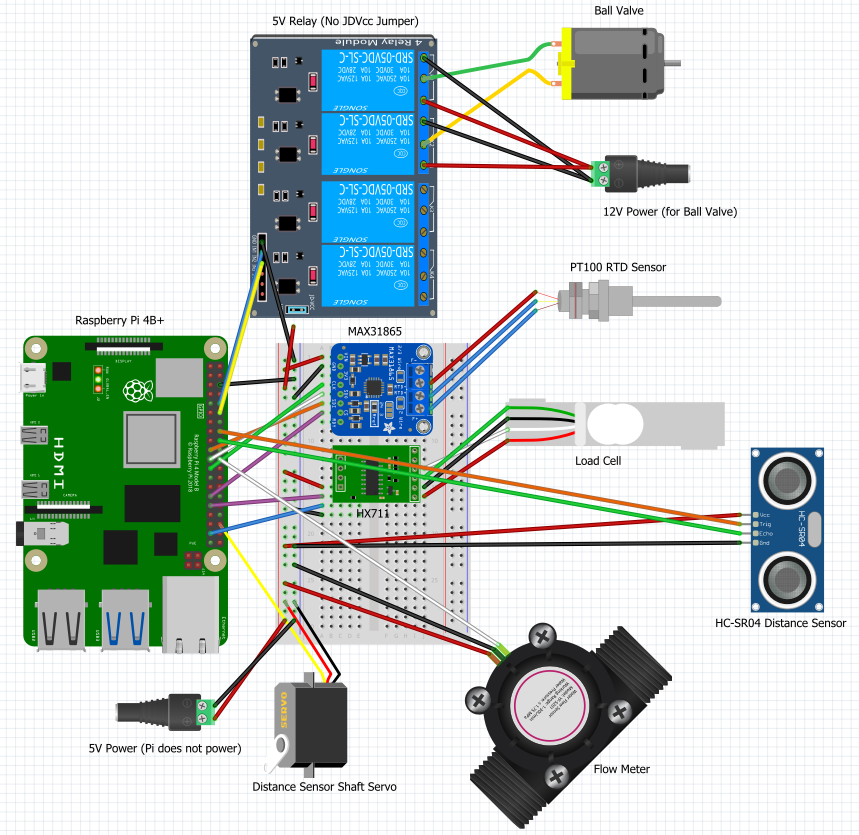

# Distillation_Pi
Software that automates distillation processes for various ethanol solutions. 

## Electronics Equipment
1. Raspberry Pi 4B+
2. RTD PT100 Temperature Sensor (Adafruit)
3. MAX31865 RTD Signal Amplifier (Adafruit)
4. 5V 8 Channel relay (Songle - Amazon)
5. 9-24V 5-wire Motorized Ball Valve (US Solid - Amazon)
6. Breadboard and Jumper Wires Kit (Amazon)
7. Soldering Kit (Amazon)

## Distillation Equipment
1. 15gal Keg (Craigslist)
2. 50gal Metal Trash Can (Hardware Store)
3. XX BTU Natural Gas Burner (Amazon)
4. Column (1.5 ft, Stainless Steel, Hardware Store)
5. Reflux Dephlegmator (1.5 ft, Stainless Steel, Ali Express)
6. Sight Glass (6 in, Ali Express)
7. Elbow (Stainless Steel, Ali Express)
8. Condenser Dephlegmator (1.5 ft, Ali Express)
9. Parrot (Stainless Steel, Ali Express)
10. Submersible Pump (550gal/hr, Amazon)
11. Aluminum Radiator (OfferUp)
12. Box Fan (Amazon)
13. Tubing (XXX, Hardware Store)
14. Tri-Clamps (XXX, Hardware Store)
15. Alcometer (Amazon)
17. Mason Jars (12 pack of ~900 mL, Walmart)

## Fritzing Circuit Diagram

## Process
1. Mash is added to the boiler container
2. The heat is turned on at a set level, allowing other process controls to determine the %ABV output
3. The distillation script is booted up
4. The RTD temperature probe at the top of the column records temperatures of the vapor product
5. The RTD temperature probe in the condensed liquid reads the temperature of the liquid product
6. The Load Cell takes the tare weight of the jars when they're added to the scale and then repeatedly (every 5 seconds) takes additional readings
7. When the jar is nearly full, an alarm will sound letting the operators know to change jars
8. All of the weight and temperature data are stored in a dataframe
9. If the temperature at the top of the column is too high (or low), the ball valve that controls the dephlegmator will open (or close) to module water flow and increase (or decrease) reflux
10. The servor motor will spin a shaft that has another shaft connected at the top at 90 degrees to swing over the jar every 30 seconds
11. The perpendicular suspended shaft has the ultrasonic distance sensor attached which will take the height of the liquid in the jar
12. Comparing the height against a table of known height:volume ratios for the jar, the volume will be taken and stored
13. Using the volume, temperature, and weight, the %Alcohol By Volume (%ABV) will be calculated and stored in the DF
14. As the ABV is calculated on a different cadence than the temperature and weight, null values will be sent for the %ABV when there is no data
15. The flow sensor is added to get an idea of reflux vs water flow rate, but has not been incorporated yet (another RTD in the heat sink will be necessary)

## Future Updates:
1. User input for target temperature and control limits
2. Integrate a few Hall Effect flow sensors into the design and use flow rate data to module ball valve
3. Incorporate the fully open or fully closed sensors to output to user that system is maxed out
4. PID Controller instead of Bang Bang if statements
5. Recommended PID controls or set points based on target product (Vodka, Tequila, Brandy, Gin, etc.)
6. Regulate the heating supply based on the vapor temps at the top of the column (municipal gas currently)
7. Front end dashboard for remote monitoring (Top of column vapor temp, condensed product temperature, total gallons extracted, total gallons of pure ethanol extracted)
8. Create dedicated printed circuit boards (PCBs)
9. Create kits of various sizes for sale
10. Integrate a Compute Module 4 instead of a 4B+
11. Use an integrated circuit to reduce the number of pins required to run the system
12. Integrate a product temperature probe to keep record of condensate. This data can be used later for %Ethanol Calculations once density data is available.
13. Integrate a fill height sensor to make volume determinations based on static jar volumes
14. Integrate a load cell to determine weight that can be used with the fill volume to determine density
15. Write a code to interpolate between the densities of water and ethanol based on the density of the material. Leverage the temperature data to ensure that the readings are calibrated accurately.
